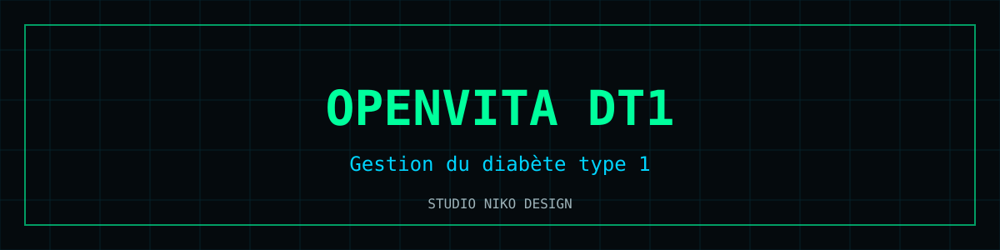

# OpenVita DT1

  

Application de **gestion du diabète de type 1** : prédictions inspirées de l'algorithme **oref1** (SMB), connexion CGM via **Nightscout**, rapports **AGP**, conforme aux notations cliniques françaises (g/L).

**Démo** : [nikoju1977.github.io/OPENVITA-DT1](https://nikoju1977.github.io/OPENVITA-DT1/)

## Fonctionnalités

- 📈 Courbes de glycémie temps réel via Nightscout (CGM)
- 💉 Calculs de bolus inspirés d'oref1 / SMB
- 📊 Rapports AGP (Ambulatory Glucose Profile)
- 📚 Référentiels **ADA 2025 / EASD / ISPAD**
- 🇫🇷 Notation clinique française g/L
- 🔐 Données stockées localement (safeStorage), aucune télémétrie

## Stack

`HTML/CSS/JS single-file` · `Nightscout API` · `Canvas charts` · `PWA` · `safeStorage`

## Lancer en local

Ouvrir `index.html`, renseigner l'URL Nightscout dans les réglages.

## ⚠️ Avertissement médical

Cette application est un **outil d'information et de suivi personnel**. Elle ne constitue pas un dispositif médical certifié, ne fournit ni diagnostic ni prescription, et ne remplace en aucun cas l'avis d'un professionnel de santé. En cas d'urgence : **15 (SAMU)** ou **112**.

> Les calculs d'insuline sont **indicatifs et pédagogiques** : toute décision thérapeutique relève de votre équipe de diabétologie.

## Licence

[MIT](LICENSE) © 2026 Nicolas Julienne — Studio Niko Design
